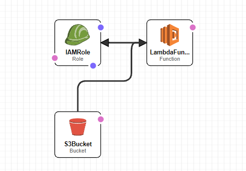

# AWS Data Engineering/DevOps project

### Table of Contents
[General Instructions](###General Instructions)
[General Description](###General Description) 
[Python Scripts](###Python Scripts)
[Infrastructure](###Infrastructure) 

### General Description 

The main goal of this project is to create the infrastructure in AWS Cloud for
Automated Processing of .txt files, with using an AWS Lambda, Injected Python Script and S3 Bucket for Storing
and Inputting the data

### Python Scripts

In this repository you can find two versions of the same script. First "script.py" - for executing in the local environment, Second "script_optimized_for_lambda.py" - specially optimized for running
in AWS Lambda environment. Documentation on every part of the script can be find "commented" in the files themselves. The only library which was used for creating scripts is injected python library "csv"
for parsing the input files, other operations were created using the core Python language. The main approach for solving the problem was to extract the unique occupations/states from the Input File then 
for each of occupations/states extract the amount of certified applications and, at the same time, the overall amount of certified applications in order to generate the percentage, finally sort the whole 
list of occupations/states firstly by amount of applications and then extract data points which have the same amount, sort them alphabetically and add to the final file. 

 
#### Explanation of methods present in a script (More detailed description can be found in files with scripts):
* find_index() - returning a dictionary with indexeses of necessary parameteres such as "Occupation" or "State"
* find_unique_names() - returns the list with unique occupations/states that present in a file 
* find_number_of_certified() - returns the list of occupations/states with the amount of certified applications and the percentage for each of the enetries
* final_prep() - performs the final sort 

### Infrastructure

The Infrastructure for processing .txt files consists of S3 bucket which is a storage for Input Files/Output Files, serverless Lambda Function for storing the script and IAM role for the Lambda 
Function. In order to create the Infrastructure Succesfully the following steps where made:
* The IAM role was created for the Lambda Function with such policies as "AmazonS3FullAccess"(Lambda will be able to read and write to the S3Bucket) and "AWSLambdaBasicExecutionRole" for monitoring the 
script
* Lambda Function was created in order to run the Python Script and lambda_handler() method was modified with the code which extracts the name of the Bucket and the name of the Object which was put in the Bucket
recently 
* S3 Bucket was created with the Notification Parameter "PUT" which is triggers the Lambda Function when a specific object is being put to the Bucket **(Unfortunately CloudFormation throws an error when you
are trying to link the S3Bucket with the Lambda using CloudFormation, so please after deploying the Infrastructure by using the "infrastructure.yaml" file, link the S3Bucket with the Lambda manually by providing a notification parameter "PUT")**
* Finally all the of the above Infrastructure was put in the "infrastructure.yaml" file and then it was used for automated provisioning of the Infrastructure using "CloudFormation". File can be found in the 
Repository
 
